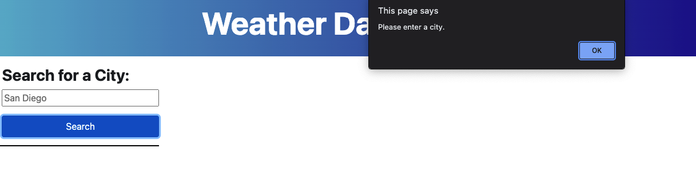

# weather_dashboard_server_apis_project

## Link
### Please click [here](https://qd9069.github.io/) to find the deployed project.


## Table of Contents 

- [Link](#link)
- [Description](#description)
- [Usage](#usage)
- [Features](#features)
- [Technology](#technology)
- [Credits](#credits)
- [Assets](#assets)


## Description

Welcome to the Weather Dashboard application webpage! 

This is a simple Weather Dashboard application that helps you to see the current weather outlook as well as the weather forecast. All you need to do is just entering a city name and click on the Search button to find a city that you are interested in. This application can show you the date, temperature, the humidity, the wind speed, and the UV index for current and future forecasted conditions.

The main purpose of this project is to build up a weather dashboard that helps people to see the weather condition so that they can plan an event or trip ahead of time. While working on this project, it provided me a good chance to practise my coding skills in both JavaScript and Bootstrap. This project also includes the use of Moment.js for time issue, AIP calls to retrieve weather data, function, as well as for loop, array, and local storage, etc.

## Usage

Here is a brief introduction for the Weather Dashboard:

- To begin using the Weather Dashboard, you will need to enter a city and click on the Search button.
    - An alart message will be triggered after clicking on the Search button if no city has been entered

- The weather information will be displayed in the webpage:
    - The current weather information, including the temperature, the humidity, the wind speed, and the UV index
    - A 5-Day Forecast for that city, including the temperature, the humidity, and the wind speed

- Everytime when you search for a city, that city will be added to the city history list, so you can review that city's weather information again

## Features

Here are some highlighted features for this application:
- This application can store cities that have been searched previously, even after refreshing the screen

- After searching a city, that city will be added to the city history list
    - The last city that you searched will be displayed at the top of the city history list
    - The first city that you searched will be displayed at the bottom of the city history list

- The UV index has a color background to indicate whether the conditions are favorable, moderate, or severe
    - If favorable: the color is green;
    - If moderate: the color is yellow;
    - If severe: the color is red;

- The application has a 5-day forecast for the city that you are searching with

- The application is also displaying the icon representation of weather conditions

## Technology

```md
- JavaScript
- HTML
- CSS
- Bootstrap
- Moment.js
```

## Credits

All weather data presented in this application is retrieving from [OpenWeather](https://openweathermap.org/api)

Below are two Third-party APIs that have been using:
- [One Call API 1.0](https://openweathermap.org/api/one-call-api)
- [Geocoding API](https://openweathermap.org/api/geocoding-api)


## Assets

The following images demonstrate the web application's appearance and functionality:

The start screen:


If click the Search button without entering a city:


The weather information after searching a city:


The weather information for a city that has been searched before:


---
Code originally by QD 2022 🏆


